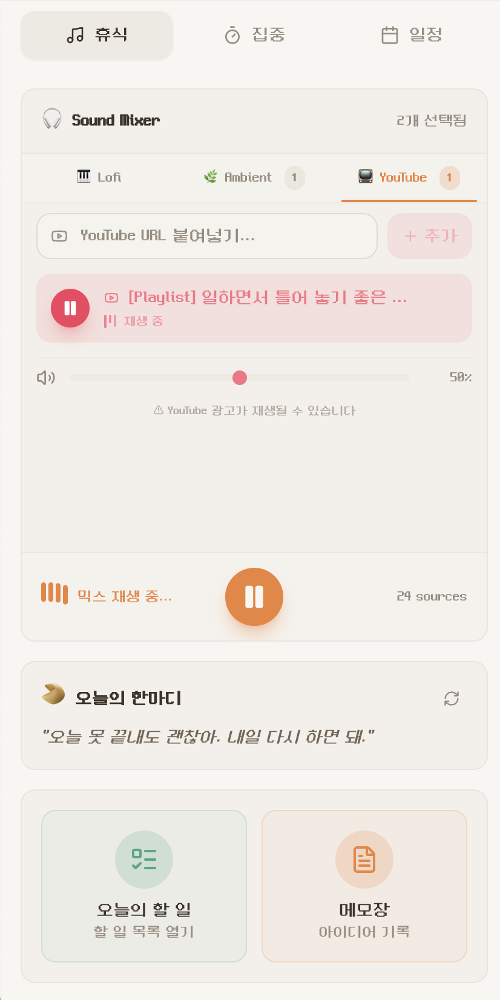
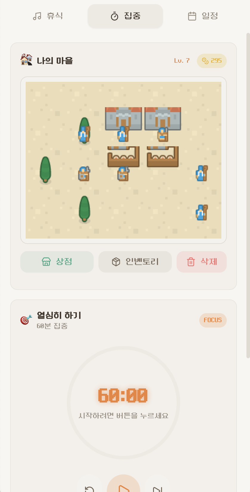
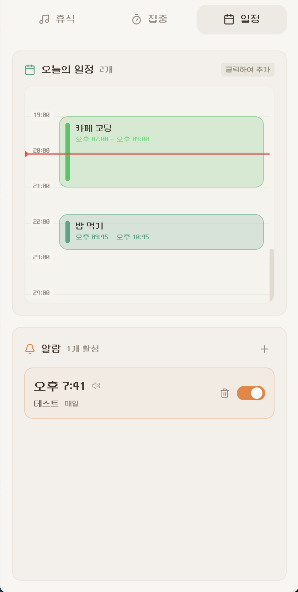
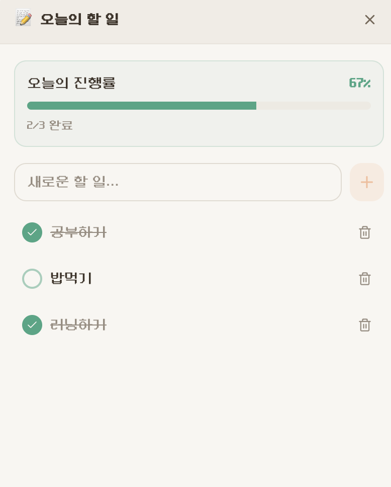
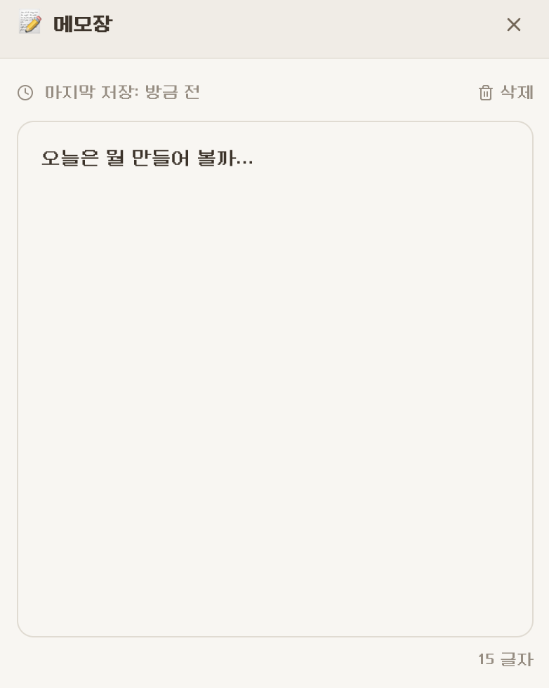
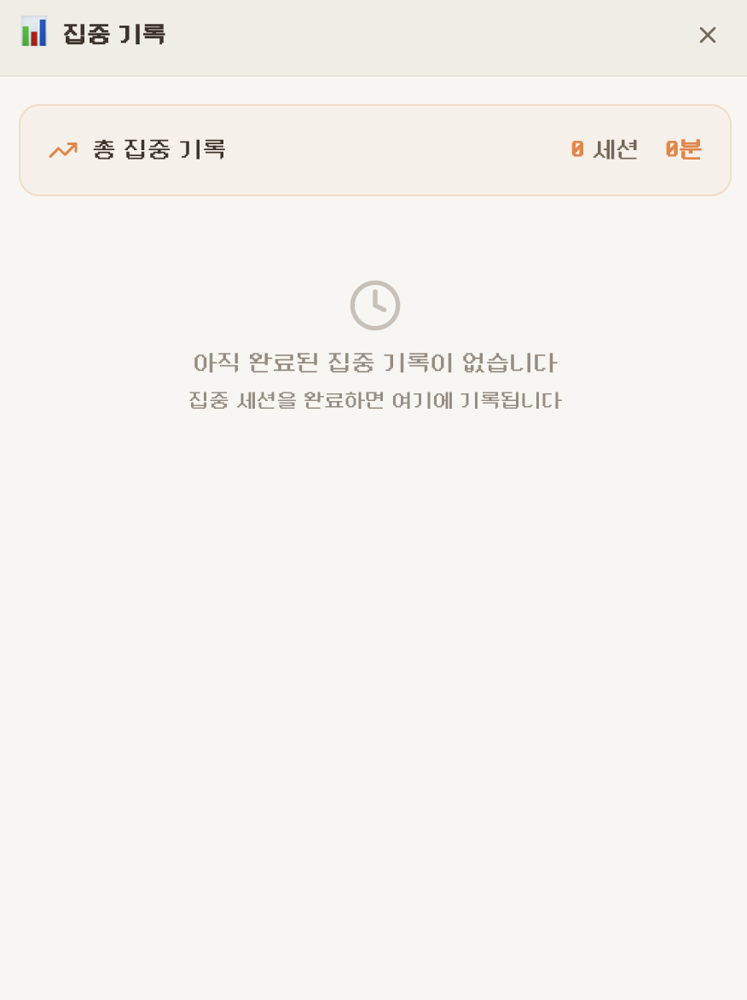

# 🏘️ Lofi Village

> 집중과 휴식을 도와주는 아늑한 Lofi 사운드 믹서 & 마을 꾸미기 앱


## ✨ 주요 기능

### 🎵 사운드 믹서

여러 앰비언트 사운드를 조합하여 나만의 집중 환경을 만들어보세요.

- **🎹 Lofi**: Lofi 비트 음악
- **🌿 Ambient**: 빗소리, 모닥불, 카페 소음, 숲속, 바람 등
- **📺 YouTube**: YouTube 영상을 플레이리스트로 관리하며 동시 재생
- 탭 기반 UI로 깔끔한 구성
- 개별 볼륨 조절 및 믹싱
- 원클릭 재생/정지

### 📺 YouTube 동시 재생

YouTube 영상을 앰비언트 사운드와 함께 재생하세요.

- YouTube URL 입력으로 플레이리스트에 추가
- 여러 영상을 저장하고 선택 재생
- 영상 제목 자동 표시
- 볼륨 개별 조절
- Sound Mixer와 동시 재생 지원

### 📋 일정 큐 & 동적 타이머

유연한 집중/휴식 사이클을 관리하세요.

- ⚡ 짧은 집중 (30분), 🎯 표준 (60분), 🔥 딥 워크 (120분) 프리셋
- 커스텀 시간 설정 (5분 ~ 240분)
- 자동 휴식 삽입 (집중 시간의 1/6 비율)
- 연속 일정 관리 및 스킵 기능
- 세션 완료 시 코인 보상 & 알림

### 🏘️ 마을 꾸미기

집중한 시간만큼 코인을 모아 마을을 성장시키세요.

- **126개의 중세 테마 에셋** (타일 58개, 자연물 21개, 건물 23개, 유닛 24개)
- 레이어 기반 맵 시스템 (타일 → 자연물 → 건물 → 유닛)
- 상점에서 구매 → 인벤토리에서 배치
- 전체 삭제 및 마을 초기화 기능

### 🥠 포츈 쿠키

매일 새로운 동기부여 메시지를 받아보세요.

### 🚀 빠른 실행

별도 창으로 빠르게 기능에 접근하세요.

- **오늘의 할 일**: 할 일 목록 전용 창
- **메모장**: 메모 전용 창
- 메인 창과 독립적으로 사용 가능

### 📝 할 일 목록

오늘의 목표를 설정하고 완료해 나가세요.

- **진행률 표시**: 완료율 퍼센트 및 프로그레스 바
- **완료 토글**: 클릭으로 완료/미완료 전환
- **자동 저장**: localStorage에 자동 저장
- **별도 창 지원**: 독립 창에서 집중 관리

### 📓 메모장

아이디어와 생각을 자유롭게 기록하세요.

- **자동 저장**: 1초 후 자동 저장 (디바운스)
- **마지막 저장 시간**: 저장 시점 확인 가능
- **글자 수 카운트**: 실시간 글자 수 표시
- **별도 창 지원**: 독립 창에서 편하게 작성

### 📊 집중 기록

완료된 포커스 세션을 기록하고 통계를 확인하세요.

- **날짜별 그룹화**: 오늘/어제/날짜별 정리
- **총 집중 통계**: 전체 세션 수, 총 집중 시간
- **세션 상세 정보**: 완료 시간, 집중 시간 표시
- **기록 정리**: 완료된 기록 일괄 삭제

### 📅 일정 관리 (타임라인 UI)

Google 캘린더 스타일의 타임라인에서 오늘의 일정을 한눈에 확인하세요.

- **타임라인 뷰**: 00:00~24:00 시간축에 일정 블록 표시
- **시간 기반 블록**: 일정 길이에 따라 블록 높이 자동 조절
- **현재 시간 인디케이터**: 빨간 선으로 현재 시간 표시
- **자동 스크롤**: 탭 진입 시 현재 시간 위치로 자동 이동
- **인라인 추가/수정**: 타임라인 클릭으로 바로 일정 추가
- **시작/종료 시간**: 일정의 시작과 종료 시간 설정
- **상태 구분**: 진행 중(초록) / 예정(파랑) / 완료(회색) 색상 표시
- **스마트 알림**: 일정 시작 **10분 전** 자동 알림
  - 🔔 시스템 팝업 알림 (Web Notification API)
  - 🔊 TTS 음성 안내 (일정 제목, 장소 읽어주기)

### ⏰ 알람

반복 알람으로 규칙적인 일상을 만들어보세요.

- **시간 설정**: 원하는 시간에 알람 설정
- **반복 요일 선택**: 특정 요일만 또는 매일 반복
- **알람 이름**: 알람에 이름 지정 (선택)
- **켜기/끄기 토글**: 간편한 활성화 관리
- **알림 기능**:
  - 🔔 시스템 팝업 알림
  - 🔊 TTS 음성 안내 ("아침 운동 알람입니다")
- **프리셋 표시**: 주중, 주말, 매일 등 자동 라벨링

> 💡 **알림 권한**: 처음 알림을 받을 때 브라우저/시스템에서 알림 권한을 요청합니다. "허용"을 눌러주세요.

---

## 📸 스크린샷

### 메인 탭

|                  🎵 휴식 탭                   |                  🎯 집중 탭                   |                   📅 일정 탭                    |
| :------------------------------------------: | :------------------------------------------: | :--------------------------------------------: |
|  |  |  |
| 사운드 믹서, 포츈쿠키, 빠른 실행 | 마을 꾸미기, 타이머, 일정 큐 | 타임라인 일정, 알람 |

### 서브 기능

|                    📝 할 일 목록                    |                   📓 메모장                    |                    📊 집중 기록                    |
| :------------------------------------------------: | :-------------------------------------------: | :-----------------------------------------------: |
|  |  |  |
| 진행률 바, 완료 토글 | 자동 저장, 글자 수 | 날짜별 그룹, 통계 |

<!--
📸 스크린샷 추가 가이드:
- screenshot-relax.png: 휴식 탭 전체 (사운드 믹서 + 포츈쿠키 + 빠른 실행)
- screenshot-focus.png: 집중 탭 전체 (마을 + 타이머 + 일정 큐)
- screenshot-calendar.png: 일정 탭 전체 (타임라인 + 알람)
- screenshot-tasks.png: 할 일 목록 서브 윈도우
- screenshot-memo.png: 메모장 서브 윈도우
- screenshot-history.png: 집중 기록 (빠른 실행에서 열기)
-->

---

## 🛠️ 기술 스택

- **Framework**: [Electron](https://www.electronjs.org/) + [React](https://react.dev/)
- **Build Tool**: [electron-vite](https://electron-vite.org/)
- **Styling**: [Tailwind CSS](https://tailwindcss.com/)
- **Language**: TypeScript
- **Icons**: [Lucide React](https://lucide.dev/)
- **Font**: [네오둥근모 프로](https://neodgm.dalgona.dev/) (레트로 픽셀 폰트)

---

## 📥 다운로드 & 설치

[GitHub Releases](https://github.com/LeeKwang-min/lofi-village/releases/latest)에서 최신 버전을 다운로드하세요.

### macOS

1. `Lofi Village-x.x.x-arm64.dmg` (Apple Silicon) 또는 `Lofi Village-x.x.x-x64.dmg` (Intel) 다운로드
2. DMG 파일 열기 → `Lofi Village.app`을 Applications 폴더로 드래그
3. 처음 실행 시 보안 경고가 나타나면:
   - `시스템 설정` → `개인정보 보호 및 보안` → `확인 없이 열기` 클릭
   - 또는 터미널에서: `xattr -cr "/Applications/Lofi Village.app"`

### Windows

1. `Lofi Village Setup x.x.x.exe` 다운로드
2. 설치 파일 실행
3. "Windows의 PC 보호" 경고 시: `추가 정보` → `실행` 클릭

### Linux

1. `Lofi Village-x.x.x.AppImage` 다운로드
2. 실행 권한 부여: `chmod +x Lofi\ Village-x.x.x.AppImage`
3. 실행: `./Lofi\ Village-x.x.x.AppImage`

> ⚠️ **참고**: 현재 앱은 코드 서명이 되어있지 않아 OS에서 보안 경고가 나타날 수 있습니다. 오픈소스 프로젝트로, 소스 코드를 직접 확인하실 수 있습니다.

---

## 🚀 개발 환경 설정

### 요구사항

- Node.js 18.0.0 이상
- npm 또는 yarn

### 설치 및 실행

```bash
# 저장소 클론
git clone https://github.com/LeeKwang-min/lofi-village.git
cd lofi-village

# 의존성 설치
npm install

# 개발 모드 실행
npm run dev
```

### 빌드

```bash
# 프로덕션 빌드 (코드만)
npm run build

# 배포용 패키지 생성
npm run build:mac    # macOS (.dmg, .zip)
npm run build:win    # Windows (.exe)
npm run build:linux  # Linux (.AppImage, .deb)
```

---

## 📁 프로젝트 구조

```
lofi-village/
├── electron/              # Electron 메인/프리로드 프로세스
│   ├── main.ts
│   └── preload.ts
├── src/
│   ├── components/        # React 컴포넌트
│   │   ├── features/      # 기능별 컴포넌트
│   │   │   ├── alarm/     # 알람 관리
│   │   │   ├── event/     # 일정 관리 (타임라인 UI)
│   │   │   ├── fortune/   # 포츈 쿠키
│   │   │   ├── history/   # 집중 기록
│   │   │   ├── memo/      # 메모장
│   │   │   ├── quick-actions/ # 빠른 실행 버튼
│   │   │   ├── schedule/  # 일정 큐 & 타이머
│   │   │   ├── sound-mixer/ # 사운드 믹서 (탭 UI)
│   │   │   ├── tasks/     # 할 일 목록
│   │   │   ├── village/   # 마을 꾸미기
│   │   │   └── youtube/   # YouTube 플레이리스트
│   │   └── layout/        # 레이아웃 컴포넌트
│   ├── config/            # 설정 파일
│   │   └── villageAssets.ts  # 126개 마을 에셋 정의
│   ├── contexts/          # React Context (Event, Alarm 등)
│   ├── hooks/             # 커스텀 훅 (useEventReminder, useAlarmReminder)
│   ├── services/          # 서비스 (알림, 일정 큐 등)
│   ├── types/             # TypeScript 타입 정의 (event.ts, alarm.ts)
│   └── index.css          # 전역 스타일 & 테마
├── public/
│   ├── fonts/             # 커스텀 폰트 (네오둥근모)
│   ├── map/               # 마을 타일맵 에셋
│   └── sounds/            # 사운드 파일
└── package.json
```

---

## 🎨 테마

현재 **Cozy Morning Cafe** 테마가 적용되어 있습니다.

- 밝고 따뜻한 크림색 배경
- 테라코타 오렌지 액센트
- 자연스러운 그린 포인트

---

## 📄 라이선스

MIT License

---

## 🙏 크레딧

- 사운드: [Pixabay](https://pixabay.com/) (무료 상업용 라이선스)
- 타일맵 에셋: [Kenney](https://www.kenney.nl/) CC0 라이선스
- 폰트: [네오둥근모 프로](https://neodgm.dalgona.dev/) by Dalgona (OFL 라이선스)

---

<p align="center">
  Made with ☕ and 🎵
  <br><br>
  Made by <a href="https://github.com/LeeKwang-min">@LeeKwang-min</a>
</p>
